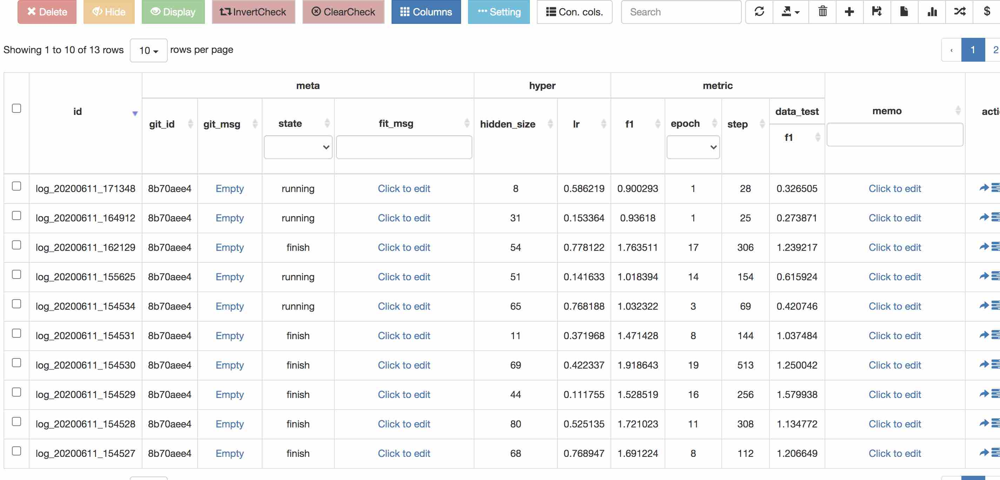
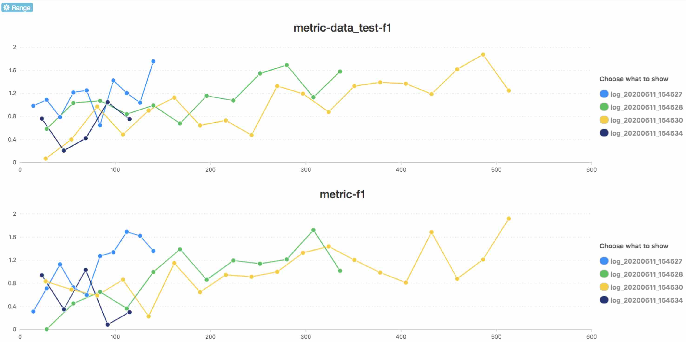

# fitlog
[](https://pypi.org/project/fitlog)
[](http://fitlog.readthedocs.io/?badge=latest)

fitlog = fast + git + log, 是一款用于辅助用户记录日志和管理代码的工具，主要支持 Linux 和 macOS，也支持在 Windows 的 Git Bash 中使用。 

[fitlog中文文档](https://fitlog.readthedocs.io/zh/latest/)

## file structure
```
|-setup.py
|-docs
|-fitlog
|  |--- init
|  |--- fastlog
|  |--- fastgit
|  |--- server
|-test
  
```

## update schedule

filog 是我们实验室内部使用的一款工具，大部分功能口口相传，文档和教程还没有特别全。感谢大家的尝试使用，遇到问题可以在 Issues 处提出。


## 一些使用说明
1. 如果在debug阶段，不希望fitlog发生任何作用，那么直接在入口代码处(import fitlog的下一行)加入fitlog.debug()就可以让所有的fitlog调用不起任何作用，debug结束再注释掉这一行就可以了。 如果希望在某一段代码不要记录，可以在这段代码之前fitlog.debug(flag=True), 跑出这段代码之后fitlog.debug(flag=True)即可恢复
2. fitlog默认只有在产生了第一个metric或loss的时候才会创建log文件夹，防止因为其它bug还没运行到model就崩溃产生大量无意义的log。
3. 如果使用了分布式训练，一般只需要主进程记录fitlog就好。这个时候可以通过将非主进程的fitlog设置fitlog.debug()
    ```python
    import torch
    import fitlog
    
    if torch.distributed.get_rank()>0:
        fitlog.debug()
    ```
4. 不要通过多进程使用fitlog，即multiprocessing模块。
5. fitlog.commit()只需要在某个python文件调用就可以了，一般就在入口python文件即可。 
6. 传入到fitlog的各种参数、metric的名称，请 **避免特殊符号（例如$%!#@空格），请只使用_与各种字母的组合** ，因为特殊符号可能导致网页端显示不正常。
7. **在命令行中通过fitlog log logs打开网页的时候，如果出现了网页无法访问的情况，首先检查一下ip地址是否正确，例如如果是在服务器上启动的服务，在电脑这端应该用http://服务器的ip:5000 来访问，如果是在本地电脑启动的，可以尝试通过http://0.0.0.0:5000 或http://127.0.0.1:5000 或http://localhost:5000 访问。如果以上仍然不能访问，可以通过ctrl+c关闭fitlog服务，然后通过命令fitlog log logs --ip 127.0.0.1启动再试一下能不能访问。**

## Developing Features(2020.09.13)

以下为正在开发中的功能，API 可能发生变化。

为函数 `fitlog.finish` 增加了可选参数 send_to_bot，传入一个字符串，为飞书机器人的 webhook 地址。 使用这个参数可以让用户在训练完成时收到通知。

例如：设定 status 为 1， send_to_bot 为 webhook 的地址，可让飞书机器人发布训练发生错误的讯息。（status默认值为0，表示实验成功结束）

```python
fitlog.finish(status=1,
	send_to_bot="https://open.feishu.cn/open-apis/bot/v2/hook/xxxxxxxx")      
```

#### 添加飞书机器人的方法

如下图所示，打开群聊后点击 "设置-群机器人-添加机器人-Custom Bot" 可以打开机器人窗口，点击添加后可以获得飞书机器人的 webhook 地址。

  

另外，可以参考[一个人也可以用的群聊机器人](https://getfeishu.cn/hc/zh-cn/articles/360024984973-%E5%9C%A8%E7%BE%A4%E8%81%8A%E4%B8%AD%E4%BD%BF%E7%94%A8%E6%9C%BA%E5%99%A8%E4%BA%BA)

## New Features(2020.06.11)
以下的功能都没有经过实战使用检验，可能有bug。
#### 1. 支持一些复杂筛选条件
 现在支持在Table那个页面的search框中输入复杂搜索逻辑进行筛选，例如下面log
 
  

想要搜索**2020年06月11号15点到2020年06月11号16点之间，并且hidden_size大于60**的log, 可以通过下面的语法输入到search框中  
```
${'id':'log_20200611_150000<=&&<=log_20200611_160000', 'hyper-hidden_size':'>60'}$
```
使用效果如下（只显示满足条件的log了）

  


其中开头结尾的$是特殊标记符号，申明这是特殊搜索，否则fitlog会只进行常规字符串匹配搜索。由于search框一旦有文字就会触发搜索，所以建议在其他地方把文本编辑好，直接复制到search框中。支持的search语法规则如下
1. 支持使用list表达或的关系。比如{"hyper-lr":[0.3, 0.1]}表示等于0.3或者0.1都会显示在前端。  
2. 支持通过>,<,<=,>=表示范围.{"hyper-lr":"<0.3", "hyper-dropout":">0.5"}表示lr小于0.3且dropout大于0.5的才保留。 大于小于符号可以在条件的最右边或者最左边，即"<0.5"或"0.5>"是等价的。
3. 支持不等式操作，例如{'hyper-dropout':"!=0.4"}则为dropout不是0.4的才会保留  
4. 使用大于小于的场景，支持通过&&表达并且如{"hyper-lr":"0.1<&&<0.3"}，表示lr需要大于0.1但小于0.3。
5. 不同column之间默认是and的关系比如{"hyper-lr": 0.1, "hyper-dropout":0.3}表示lr和dropout同时为0.1和0.3的log; 如果需要使得不同column之间为或的关系，可以通过在filter_condition中加入一个特殊的字段and_filters, 以下的条件表示是不同filter为或的关系{"and_filters":0, "hyper-lr": 0.1, "hyper-dropout":0.3}, 请通过0或1表示and_filters。
**申明某个column时，它名称是从最top的header一路到最底层的header，通过-连接。例如hyper下面的hidden_size, 搜索的时候条件应该写为hyper-hidden_size。**

#### 2.支持多条log的metric收敛曲线对比
操作如下图所示，先选择需要对比的log(默认只能选择10条)，然后点击右上角红色框处 


然后会弹出选择需要对比的metric，选好需要对比的metric后点击确认跳转，跳转后界面为



我十分垃圾的js代码能力坚定地告诉我：你们一定不可能需要对比loss曲线的，所以我就没有必要再做loss对比了🐶。
